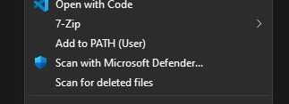
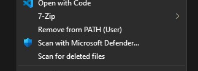

# AddToPath

With this tool you can quickly add and remove directories from the PATH environment variable straight from the context menu.

## Installation

Download the latest installer from [Releases](https://github.com/urholaukkarinen/AddToPath/releases)

---

